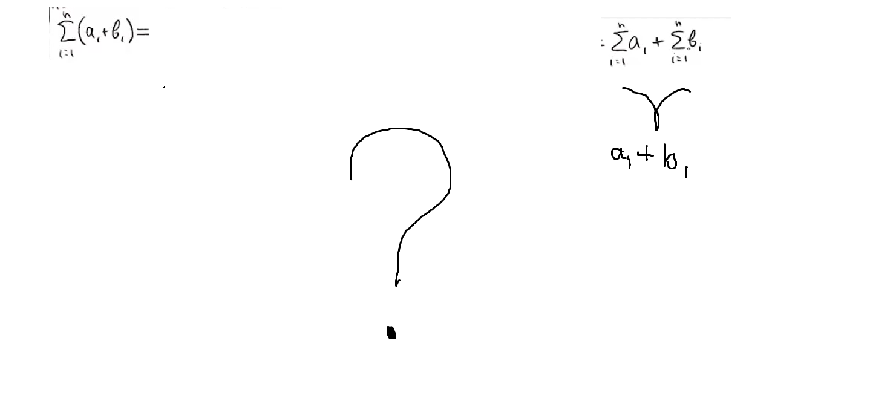

                                ლუწი ციფრების ჯამი
იმისათვის, რომ ვიპოვოთ ლუწი ციფრების ჯამი უნდა გამოვიყენოთ ფორმულა: Sum = n(n+1)
მაგალითად თუ გვინდა ვიპოვოთ პირველი 20 ლუწი ციფრის ჯამი: Sum = 10(10+1) Answer: 110
10-ის ჩათვლით ყველა ლუწი ციფრის ჯამია 5(5+1)= 30 
                                      (2+4+6+8+10 = 30)
100-ში არის 50 ლუწი: 50(50+1) Answer:  100-ში არსებული ყველა ლუწი რიცხვისა და ციფრის ჯამია 2550 

                                კენტი ციფრების ჯამი
იმისატვის რომ ვიპოვოთ კენტი ციფრების ჯამი საკმარისია ვიცოდეთ კენტი ციფრების რაოდენობა, ფორმულა: n*n (ანუ n-ის კვადრატი).
10-ის ჩათვლით ყველა კენტი ციფრის ჯამია (5*5)=25
                                    (1+3+5+7+9)=25
მაგალითად: 100-ში არის 50 კენტი ციფრი, მათი ჯამი კი იქნება (50*50) = 2500, Answer: 100-ში არსებული ყველა კენტი რიცხვისა და ციფრის ჯამია 2500 

                                        ფორმულა n(n+1)/2

​n(n+1)/2 მუშაობს როგორც კენტ ასევე ლუწ ციფრებზე და რიცხვებზე.
მაგალითად: 100(100+1)/2 = 5050
თუ ავიღებთ ზედა ორ მაგალითს სადაც ლუწი და კენტი ციფრების ჯამები ცალკ-ცალკე ვიპოვეთ (ლუწი: 2550; კენტი: 2500) და 
შევკრიბავთ მათ, მივიღებთ იგივე პასუხს რაც n(n+1)/2-ამ ფორმულით მივიღეთ, ორივე შემთხვევაში პასუხი 5050 გამოდის.

                       ∑ (sigma)

